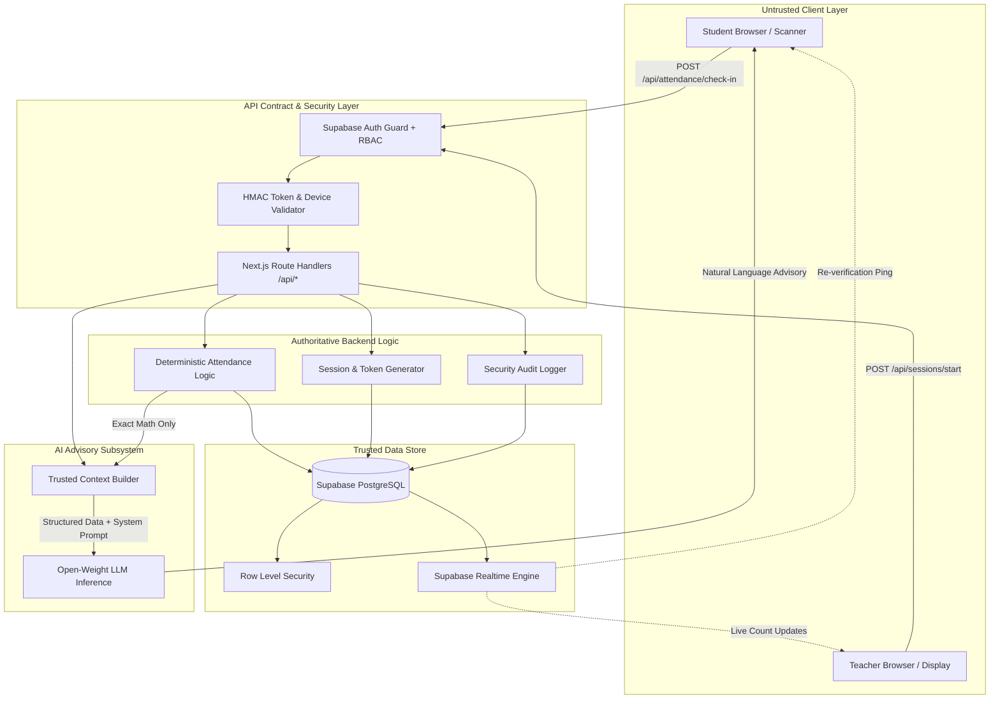
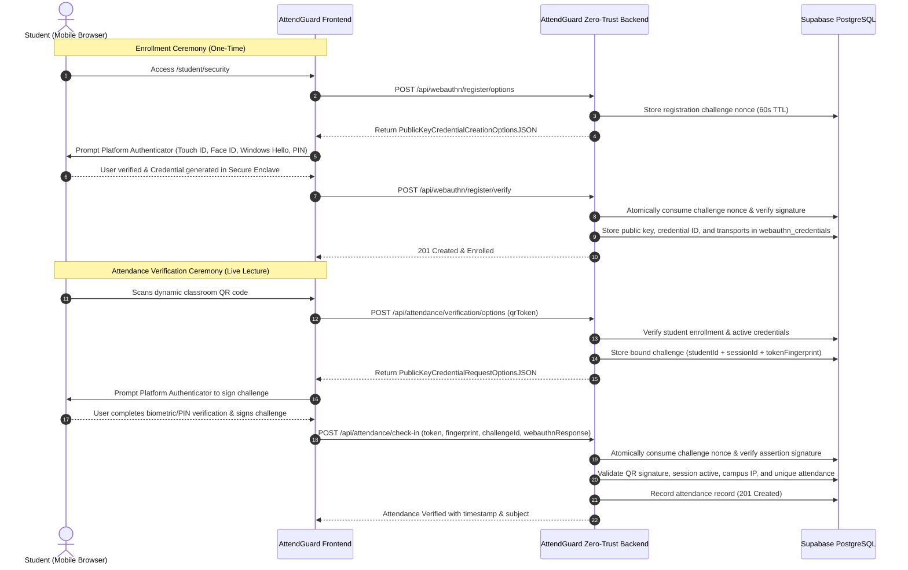

# AttendGuard

> **Verified Attendance & Proxy Prevention System**  
> *A multi-layered attendance verification platform for educational institutions designed to significantly reduce proxy attendance, QR sharing, and check-in abuse.*

---

## Table of Contents

- [Overview](#overview)
- [The Problem](#the-problem)
- [The Solution](#the-solution)
- [Key Features](#key-features)
- [User Roles & Permissions](#user-roles--permissions)
- [Technology Stack](#technology-stack)
- [System Architecture](#system-architecture)
- [Repository Structure](#repository-structure)
- [Team Structure & Ownership](#team-structure--ownership)
- [Local Setup & Getting Started](#local-setup--getting-started)
- [Environment Variables](#environment-variables)
- [Supabase Setup](#supabase-setup)
- [Development Commands](#development-commands)
- [Testing](#testing)
- [Deployment](#deployment)
- [Security Model & Limitations](#security-model--limitations)
- [Future Improvements](#future-improvements)
- [Documentation Index](#documentation-index)
- [License](#license)

---

## Overview

Traditional attendance methods—such as paper sign-in sheets, static roll calls, and simple one-click digital check-ins—are notoriously susceptible to fraud. Students frequently mark attendance on behalf of absent peers, photograph and transmit static QR codes across campus group chats, or check in from outside the classroom and depart immediately.

**AttendGuard** addresses this vulnerability by replacing simple "Present" buttons with a **multi-layered, server-authoritative verification pipeline**. Combining short-lived dynamic QR tokens, registered device tracking, server-side temporal validation, and randomized in-class re-verifications, AttendGuard provides educational institutions with a dependable, auditable record of actual classroom presence without requiring expensive proprietary hardware.

> [!NOTE]
> AttendGuard is engineered to substantially reduce common attendance fraud vectors. It does not claim to be "100% cheat-proof" or "impossible to hack," as no software-only solution can guarantee continuous physical presence with absolute certainty.

---

## The Problem

Educational institutions face persistent integrity challenges with contemporary attendance tracking:

1. **Proxy Attendance**: Students sign paper rosters or hit web buttons for absent friends.
2. **QR Code Sharing**: Static QR codes projected on classroom screens are photographed and forwarded to messaging groups within seconds, enabling students across campus or off-site to register attendance.
3. **Account Sharing**: Students log into their peers' credentials on laptops or mobile devices to mark attendance remotely.
4. **False Check-Ins**: Location or client-claimed presence is falsified using spoofed browser state or forged HTTP requests.
5. **Check-In-and-Leave Abuse**: Students attend the first 3 minutes of a lecture, mark their attendance, and slip out undetected for the remaining class duration.
6. **Inaccurate Attendance Records**: Teachers lack real-time visibility into attendance counts vs. physical headcounts, while students lack trusted, actionable insight into their attendance requirements.

---

## The Solution

AttendGuard enforces a strict architectural boundary: **The frontend is an untrusted client, and the backend is the sole authority for attendance state.**


1. **Teacher-Controlled Live Sessions**: Attendance cannot be logged unless an authorized teacher has an active, monitored session running.
2. **Time-Bound Dynamic QR Challenges**: The classroom screen displays a rotating QR code backed by a cryptographically signed, short-lived server token (15–30 second TTL). Forwarded screenshots expire before remote peers can scan them.
3. **Single Registered Device Enforcement**: Students bind their student account to one trusted mobile device. Multiple logins from unregistered hardware trigger security alerts and require teacher authorization.
4. **Authoritative Server Validation**: All timestamps, token validity, enrollment checks, and duplicate verifications occur exclusively within Next.js Route Handlers and PostgreSQL constraint layers.
5. **Random In-Class Re-Verification**: During the lecture, the teacher can trigger a surprise short-window re-verification prompt on student devices, thwarting check-in-and-leave tactics.
6. **AI Attendance Advisor**: An integrated open-weight LLM processes trusted backend calculations to provide students with actionable academic attendance advice (e.g., classes needed to maintain 75% eligibility).

---

## Key Features

| Feature | Description | Target User |
| :--- | :--- | :--- |
| **Dynamic QR Projection** | Rotates cryptographically signed challenge tokens every 15–30 seconds. Prevents photo forwarding. | Teacher |
| **Single Registered Device** | Restricts student accounts to a single verified device hardware/browser fingerprint. Prevents credential lending. | Student / System |
| **Realtime Headcount** | Live Supabase Realtime dashboard reflecting verified check-ins against classroom capacity. | Teacher |
| **Random Re-Verification** | Timed, unexpected 60-second micro-challenge mid-lecture to confirm sustained physical presence. | Teacher & Student |
| **Server-Side Authority** | Attendance calculations, unique database constraints, and signed HMAC/JWT verification done strictly server-side. | Backend |
| **Attendance Analytics** | Visual charts (Recharts) detailing attendance percentages, streak data, and warning levels. | Teacher & Student |
| **AI Attendance Advisor** | Plain-language academic advisor explaining trusted calculations without hallucinating metrics. | Student |
| **Tamper-Evident Audit Logs** | Comprehensive event logging for suspicious login attempts, expired scans, and device resets. | Administration |

---

## User Roles & Permissions

AttendGuard defines two primary roles authenticated via Supabase Auth:

### 1. Student (`role: 'student'`)
- Authenticate via institutional credentials.
- Register and maintain one active primary mobile device.
- Scan dynamic QR challenges during active classroom sessions.
- Respond to random in-class re-verification prompts.
- View personal attendance history, percentages, and class-wise summaries.
- Interact with the AI Attendance Advisor for predictive eligibility guidance.

### 2. Teacher (`role: 'teacher'`)
- Authenticate via faculty credentials.
- View and manage assigned classes and enrollments.
- Start and end time-limited attendance sessions.
- Project dynamic, auto-refreshing QR challenges onto classroom displays.
- Monitor live attendee lists and count metrics in real time.
- Trigger random in-class re-verifications.
- Review attendance audit logs, approve device reset requests, and export reports.

---

## Technology Stack

The stack is intentionally selected for production robustness, fast iteration, and strict server-side validation:

```
┌────────────────────────────────────────────────────────┐
│                        FRONTEND                        │
│   Next.js (App Router) • TypeScript • Tailwind CSS     │
│             shadcn/ui • Recharts (Analytics)           │
├────────────────────────────────────────────────────────┤
│                        BACKEND                         │
│     Next.js Route Handlers • Node.js Crypto (HMAC)     │
│                 Supabase PostgreSQL + RLS              │
├────────────────────────────────────────────────────────┤
│                 REALTIME & PERSISTENCE                 │
│      Supabase Auth • Supabase Realtime Subscriptions   │
├────────────────────────────────────────────────────────┤
│                     INTELLIGENCE                       │
│    Open-Weight LLM (Llama 3 / Mistral) Inference Layer │
│              Strict Context Injection Architecture     │
├────────────────────────────────────────────────────────┤
│                DEPLOYMENT & VERSION CONTROL            │
│                 Vercel • Supabase • Git/GitHub         │
└────────────────────────────────────────────────────────┘
```

- **Frontend**: Next.js (App Router), TypeScript, Tailwind CSS, shadcn/ui
- **Backend**: Next.js Route Handlers (Server-side Next.js logic)
- **Database**: Supabase PostgreSQL with Row Level Security (RLS)
- **Authentication**: Supabase Auth (Session management, RBAC)
- **Realtime Updates**: Supabase Realtime (WebSockets for live attendances and re-verifications)
- **QR Engine**: Browser-based scanning (`html5-qrcode` / browser barcode APIs) and server-generated challenge tokens
- **Data Visualization**: Recharts
- **AI Inference**: Open-weight / open-source LLM (e.g., Llama 3 / Mistral 7B) accessed via an OpenAI-compatible inference layer (Ollama, Together AI, or Groq)
- **Deployment**: Vercel (Edge/Serverless Web App) + Supabase (Managed Postgres, Auth, Realtime)
- **Version Control**: Git & GitHub

> [!IMPORTANT]
> Unnecessary infrastructure (Kubernetes, Kafka, microservices, custom blockchain ledgers, biometric face recognition cameras, fingerprint hardware) is **strictly excluded** from the core project to ensure reliable hackathon execution.

---

## System Architecture

AttendGuard follows a layered architecture with explicit trust boundaries:



For full architectural specifications, see [docs/ARCHITECTURE.md](docs/ARCHITECTURE.md).

---

## Repository Structure

```text
attendguard/
├── .github/
│   └── workflows/              # CI/CD linting and typecheck pipelines
├── docs/                       # Complete engineering documentation
│   ├── ARCHITECTURE.md         # System architecture & trust boundaries
│   ├── API.md                  # Integration contract (All REST endpoints)
│   ├── DATABASE.md             # Supabase schema, constraints & RLS
│   ├── AUTHENTICATION.md       # Supabase Auth, RBAC & Device Tracking
│   ├── SECURITY.md             # Threat model, attack vectors & mitigations
│   ├── ATTENDANCE-FLOW.md      # End-to-end workflows & sequence diagrams
│   ├── FRONTEND.md             # Next.js UI conventions, states & styling
│   ├── AI.md                   # AI Attendance Advisor architecture
│   ├── TESTING.md              # Unit, integration, security & UI test plans
│   ├── GIT-WORKFLOW.md         # Branch strategy, ownership & PR workflow
│   └── ROADMAP.md              # 5-phase execution & delivery timeline
├── src/
│   ├── app/
│   │   ├── (auth)/             # Login, signup, reset password pages
│   │   ├── student/            # Member 2: Student portal & dashboard
│   │   │   ├── scanner/        # QR Scanner UI
│   │   │   ├── history/        # Attendance logs & history
│   │   │   └── advisor/        # Member 4: AI Advisor UI
│   │   ├── teacher/            # Member 3: Teacher portal & dashboard
│   │   │   ├── classes/        # Class management
│   │   │   ├── sessions/       # Live attendance & dynamic QR projection
│   │   │   └── reports/        # Reports & analytics view
│   │   └── api/                # Member 1: Server-authoritative Route Handlers
│   │       ├── auth/           # Device & role verification
│   │       ├── sessions/       # Session creation, rotation, termination
│   │       ├── attendance/     # Check-in & re-verification validation
│   │       └── ai/             # AI Advisor context proxy
│   ├── components/
│   │   ├── ui/                 # Shared shadcn/ui components (Buttons, Modals, Cards)
│   │   ├── student/            # Student UI components
│   │   ├── teacher/            # Teacher UI components
│   │   └── qr/                 # QR Display & Reader components
│   ├── lib/
│   │   ├── supabase/           # Supabase client & server instances
│   │   ├── auth/               # Role checks & session helpers
│   │   ├── attendance/         # Attendance math & calculation engines
│   │   ├── qr/                 # Cryptographic token generator & validator
│   │   └── ai/                 # Open-weight inference client & prompt templates
│   └── types/                  # Shared TypeScript interfaces & API contracts
├── supabase/
│   ├── migrations/             # SQL schema migrations with RLS policies
│   └── seed.sql                # Development seed data
├── CONTRIBUTING.md             # Contribution rules & conflict prevention guide
└── README.md                   # This project overview
```

---

## Team Structure & Ownership

To maximize development velocity and eliminate git merge conflicts during the hackathon, each member has exclusive ownership over dedicated modules:

| Role | Member | Primary Modules & Directories | Key Responsibilities |
| :--- | :--- | :--- | :--- |
| **Team Lead & Backend Engineer** | **Member 1** | `src/app/api/`<br>`src/lib/supabase/`<br>`src/lib/auth/`<br>`src/lib/attendance/`<br>`src/lib/qr/`<br>`supabase/` | System architecture, PostgreSQL schema, Supabase Auth, Route Handlers, QR HMAC generator & validator, device binding logic, RLS policies, security audit logs, Vercel/Supabase deployment. |
| **Frontend Engineer: Student Experience** | **Member 2** | `src/app/student/`<br>`src/components/student/` | Student login UI, student dashboard, today's schedule, QR scanner camera integration, check-in feedback status, attendance history table, registered device view. |
| **Frontend Engineer: Teacher Experience** | **Member 3** | `src/app/teacher/`<br>`src/components/teacher/`<br>`src/components/qr/` | Teacher login UI, dashboard, class management, session start/end UI, dynamic QR projection screen, real-time live attendance counter, re-verification controls, attendance export. |
| **AI Engineer** | **Member 4** | `src/lib/ai/`<br>`src/app/student/advisor/` | AI Attendance Advisor chat interface, prompt template design, open-weight LLM inference integration, context building using backend calculations, hallucination guardrails. |

For detailed contribution guidelines and merge rules, read [CONTRIBUTING.md](CONTRIBUTING.md).

---

## Local Setup & Getting Started

### Prerequisites

- **Node.js**: Version 18.18.0 or later (LTS recommended)
- **npm** or **pnpm**
- **Git**
- A free **Supabase** account (cloud or local Supabase CLI)
- An inference endpoint (Ollama local instance or an API key from Groq / Together AI)

### Installation Steps

1. **Clone the repository**:
   ```bash
   git clone https://github.com/your-org/attendguard.git
   cd attendguard
   ```

2. **Install dependencies**:
   ```bash
   npm install
   ```

3. **Configure Environment Variables**:
   ```bash
   cp .env.example .env.local
   ```
   Fill in your Supabase credentials and AI inference keys (see [Environment Variables](#environment-variables)).

4. **Initialize Database Schema**:
   Run the SQL scripts located in `supabase/migrations/` inside your Supabase SQL Editor, followed by `supabase/seed.sql` to populate sample classes and accounts.

5. **Start the Development Server**:
   ```bash
   npm run dev
   ```
   Open [http://localhost:3000](http://localhost:3000) in your browser.

---

## Environment Variables

Create a `.env.local` file in the root directory:

```env
# ==========================================
# NEXT.JS & CORE APPLICATION
# ==========================================
NEXT_PUBLIC_APP_URL=http://localhost:3000

# ==========================================
# SUPABASE CONFIGURATION
# ==========================================
NEXT_PUBLIC_SUPABASE_URL=https://your-project-id.supabase.co
NEXT_PUBLIC_SUPABASE_ANON_KEY=eyJhbGciOiJIUzI1NiIsInR5cCI6IkpXVCJ9...
SUPABASE_SERVICE_ROLE_KEY=eyJhbGciOiJIUzI1NiIsInR5cCI6IkpXVCJ9...

# ==========================================
# ATTENDGUARD SECURITY & QR ENGINE
# ==========================================
# High-entropy secret used for HMAC-SHA256 signature generation on QR challenges
QR_HMAC_SECRET=your_32_character_minimum_random_secret_string
# Lifespan of each dynamic QR challenge in seconds (default: 20s)
QR_TOKEN_TTL_SECONDS=20

# ==========================================
# CAMPUS NETWORK & IP VERIFICATION
# ==========================================
# Toggle campus IP verification (true / false)
IP_CHECK_ENABLED=true
# Enforcement policy: 'review' (default, flag for teacher audit) or 'reject' (strict 403 denial)
IP_MISMATCH_POLICY=review
# Approved campus public IP addresses or CIDR subnets (comma-separated).
# Default loopback entries for local development. For production verification, supply
# authoritative institutional public IP CIDRs directly from campus network administration:
CAMPUS_IP_ALLOWLIST=127.0.0.1, ::1
# Reverse proxy trust settings
TRUST_PROXY=true
TRUSTED_PROXY_COUNT=1

# Optional Campus Geolocation (Untrusted supporting signal)
CAMPUS_LAT=37.7749
CAMPUS_LON=-122.4194
CAMPUS_RADIUS_METERS=150

# ==========================================
# AI INFERENCE LAYER (OPEN-WEIGHT LLM)
# ==========================================
# Compatible with OpenAI-format endpoints (Groq, Together AI, Ollama, vLLM)
AI_INFERENCE_BASE_URL=https://api.groq.com/openai/v1
AI_INFERENCE_API_KEY=gsk_your_api_key_here
AI_MODEL_NAME=llama-3.1-8b-instant
```

---

## Supabase Setup

1. **Create a new Supabase Project**: Navigate to the [Supabase Dashboard](https://supabase.com) and create an organization and project.
2. **Apply Migrations**:
   - Open the **SQL Editor** tab in Supabase.
   - Run `supabase/migrations/001_initial_schema.sql` to create core tables (`profiles`, `classes`, `attendance_sessions`, `attendance_records`, `registered_devices`, etc.).
   - Run `supabase/migrations/002_rls_policies.sql` to apply security rules.
   - Run `supabase/migrations/003_performance_indexes.sql` to build composite query indexes.
   - Run `supabase/migrations/004_auth_profile_provisioning.sql` for automated auth profile provisioning.
   - Run `supabase/migrations/005_role_security_and_profile_immutability.sql` to enforce role integrity.
   - Run `supabase/migrations/006_data_retention_and_relational_integrity.sql` for retention constraints.
   - Run `supabase/migrations/007_device_security_and_reverify_persistence.sql` for device binding rules.
   - Run `supabase/migrations/008_attendance_lifecycle_state_machine.sql` for session states.
   - Run `supabase/migrations/009_rls_security_hardening.sql` for RLS hardening.
   - Run `supabase/migrations/010_ip_verification_and_security_events.sql` to extend `attendance_records` with IP verification fields and create the tamper-evident `security_events` audit table with teacher/student RLS policies.
3. **Configure Authentication**:
   - In **Authentication > Providers**, ensure Email/Password provider is enabled.
   - Disable email confirmation in development for rapid testing.
4. **Enable Realtime**:
   - Go to **Database > Publications** and ensure `attendance_sessions` and `attendance_records` are enabled for the `supabase_realtime` publication.
5. **Seed Test Data**:
   - Run `supabase/seed.sql` to populate test teachers, students, and enrolled courses.

For complete database schema specifications, see [docs/DATABASE.md](docs/DATABASE.md).

---

## Campus IP & Network Verification

AttendGuard integrates an authoritative server-side IP verification service to protect attendance integrity:

### Verification Pipeline
1. **Authoritative Client IP Detection**: The backend extracts the client's observed IP from the TCP connection or trusted reverse proxy headers (`X-Forwarded-For`, `X-Real-IP`).
2. **Reverse Proxy Hardening**: Configurable through `TRUST_PROXY` and `TRUSTED_PROXY_COUNT`. When untrusted, client-forged `X-Forwarded-For` headers are stripped and ignored.
3. **Format Normalization**: Handles IPv4, IPv6, bracketed IPv6, and IPv4-mapped IPv6 addresses (`::ffff:192.168.1.1`).
4. **CIDR Subnet Matching**: Checks exact IP addresses and CIDR subnets (e.g. `192.168.1.0/24`, `2001:db8::/32`).
5. **Configurable Enforcement Policy**:
   - `IP_MISMATCH_POLICY=review` (Default & Recommended): The check-in is logged as present, but flagged with `ip_verification_status: 'review_required'` and emits an audit event for teacher review.
   - `IP_MISMATCH_POLICY=reject`: Stricter enforcement that returns `403 Forbidden` (`CAMPUS_NETWORK_MISMATCH`) and prevents attendance creation.
   - `IP_CHECK_ENABLED=false` or unconfigured allowlist: Permissively sets status to `skipped` or `not_configured` to prevent development blockage.

### Known Limitations of IP-Based Verification
- **Carrier CGNAT & Mobile Hotspots**: Students connected via cellular data will present cellular carrier gateway IPs rather than the campus Wi-Fi IP. This is why AttendGuard uses `IP_MISMATCH_POLICY=review` by default rather than blocking students outright.
- **Institutional Multi-Subnet Campus**: Large universities with multiple Wi-Fi SSIDs (e.g., eduroam, guest, dorms) must have all public gateway CIDR blocks added to `CAMPUS_IP_ALLOWLIST`.
- **Campus VPN**: Authorized students connecting via institutional VPN share the campus gateway IP, which matches the allowlist. Unauthorized off-campus VPN connections will mismatch.

---

## Development Commands

| Command | Description |
| :--- | :--- |
| Execute tests locally:

```bash
npm test
```

Read the full test specifications and testing matrix in [docs/TESTING.md](docs/TESTING.md).

---

## AI & Attendance Intelligence Engine

AttendGuard incorporates a deterministic risk analytics engine and a conversational AI Attendance Advisor:

### Architecture & Design Principles
1. **Deterministic Analytics is the Single Authority**: All percentages, risk tiers, and projections are computed algebraically in pure TypeScript. An LLM is never allowed to guess or compute attendance metrics.
2. **AI as an Empathetic Explainer**: Gemini 2.5 Flash translates pre-computed mathematical facts into encouraging, actionable guidance.
3. **No Direct Database Writes by AI**: The advisor operates in a read-only environment; prompt injection attacks cannot alter institutional records.
4. **Server-Side API Security**: The `GEMINI_API_KEY` is strictly confined to server-side execution.
5. **Fail-Safe Offline Operation**: If Gemini is unreachable or rate-limited, the system transparently serves deterministic fallback responses with zero disruption.

### Demo Personas for Presentation

| Persona | Status | Highlight Feature | Recovery Needed |
| :--- | :--- | :--- | :--- |
| **Alex** | **Healthy (90.3%)** | All courses $\ge 88\%$; ample safe misses available. | 0 classes |
| **Maya** | **At-Risk (80.0%)** | Mathematics is slipping to 74.0% ($< 75\%$). | 2 classes in Math |
| **Jordan** | **Critical (78.5%)** | C Programming at 68.0%; high recovery burden. | 7 classes in C Prog |

---

## Deployment

### Vercel (Frontend & Route Handlers)
1. Push your repository to GitHub.
2. Import the project into the [Vercel Dashboard](https://vercel.com).
3. Set the Environment Variables defined in [Environment Variables](#environment-variables).
4. Deploy the `main` branch.

### Supabase (Database & Auth)
1. Production database runs on managed Supabase infrastructure.
2. Ensure database password, service role keys, and production CORS origins are locked down.

---

---

## WebAuthn & Cryptographic Biometric / Passkey Verification (FIDO2)

AttendGuard incorporates a production-grade WebAuthn / FIDO2 authentication layer powered by `@simplewebauthn/server` and `@simplewebauthn/browser`.

### Objective
In a university classroom, an absent student might lend their unlocked phone to a classmate to scan the attendance QR code on their behalf. AttendGuard eliminates this proxy attack vector by requiring **fresh user verification** on the device's hardware authenticator immediately before attendance is cryptographically confirmed on the server.



### Non-Negotiable Security Invariants
1. **Zero Raw Biometric Storage**: AttendGuard **never** collects, transmits, or stores raw fingerprint scans, facial geometry, or biometric templates. User biometrics are handled exclusively inside the device's secure hardware enclave (e.g., Apple Secure Enclave, Android Titan M, TPM).
2. **Cryptographic Proof Over Client Claims**: The server rejects frontend claims such as `biometricVerified: true`. Attendance is confirmed only after verifying the mathematical signature produced by the private key held in the client hardware against the stored public key.
3. **Replay & Race Condition Prevention**: Authentication challenges are unpredictable, stored in Supabase with a short TTL (60 seconds), bound to `(studentId, sessionId, tokenFingerprint)`, and consumed **atomically** in SQL (`UPDATE ... WHERE consumed_at IS NULL RETURNING *`). Two concurrent submissions cannot reuse the same challenge.
4. **Shared QR Preservation**: Rotating classroom QR codes are shared by the entire class. Consuming a WebAuthn challenge is scoped per student, ensuring multiple students scanning the same projected QR code during its 15-second rotation window do not invalidate it for each other.
5. **Enforced User Verification**: Options explicitly request `userVerification: 'required'`, ensuring the device authenticates the physical presence of the enrolled student via biometrics or screen PIN.

### Configuration & Environment Variables

Add the following WebAuthn configuration settings to your `.env` file:

```env
# WebAuthn / FIDO2 Passkey Server Configuration
WEBAUTHN_RP_NAME="AttendGuard Institutional Attendance"
WEBAUTHN_RP_ID="localhost"
WEBAUTHN_ORIGIN="http://localhost:3000"
WEBAUTHN_CHALLENGE_TTL_SECONDS="60"
```

> [!IMPORTANT]
> In production, `WEBAUTHN_RP_ID` must match your institution's domain (e.g. `attendance.university.edu`) and `WEBAUTHN_ORIGIN` must match your full HTTPS origin (e.g. `https://attendance.university.edu`). WebAuthn strictly forbids HTTP in non-localhost origins.

### Database Schema & Migrations

Migration `supabase/migrations/013_webauthn_credentials_and_challenges.sql` establishes:

* **`webauthn_credentials`**: Stores public keys and credentials bound to student accounts.
  * `id`: UUID Primary Key
  * `user_id`: UUID References `auth.users(id)`
  * `credential_id`: TEXT Unique (Base64URL identifier)
  * `public_key`: TEXT (Base64URL encoded public key)
  * `counter`: BIGINT (Signature counter tracking)
  * `device_type`: TEXT (`singleDevice` or `multiDevice`)
  * `backed_up`: BOOLEAN (Passkey sync status)
  * `transports`: TEXT[] (Supported transports e.g. `internal`, `hybrid`)
  * `created_at` / `last_used_at` / `revoked_at`: TIMESTAMPTZ
* **`webauthn_challenges`**: Single-use cryptographic nonces.
  * `id`: UUID Primary Key
  * `user_id`: UUID
  * `session_id`: UUID Nullable
  * `challenge`: TEXT
  * `purpose`: TEXT (`registration` or `attendance_authentication`)
  * `token_fingerprint`: TEXT Nullable
  * `expires_at` / `consumed_at` / `created_at`: TIMESTAMPTZ
* **Row-Level Security (RLS)**: Students may only view (`SELECT`) their own credentials; all insert/update/delete actions on credentials and challenges are restricted to server-side service-role clients.

### API Request / Response Contracts

| Endpoint | Method | Purpose | Request Payload | Response |
| :--- | :--- | :--- | :--- | :--- |
| `/api/webauthn/register/options` | `POST` | Generate registration options | None (Authenticated session) | `{ success: true, data: { options, challengeId } }` |
| `/api/webauthn/register/verify` | `POST` | Verify registration response | `{ challengeId, response }` | `{ success: true, data: { verified: true, credentialId } }` |
| `/api/webauthn/credentials` | `GET` | List student's enrolled keys | None (Authenticated session) | `{ success: true, data: { credentials: [...], count } }` |
| `/api/webauthn/credentials/:id/revoke` | `POST` | Revoke a compromised key | None (Authenticated session) | `{ success: true, data: { success: true, credentialId } }` |
| `/api/attendance/verification/options` | `POST` | Request attendance challenge | `{ challengeToken }` | `{ success: true, data: { options, challengeId, requiresRegistration } }` |
| `/api/attendance/check-in` | `POST` | Authoritative check-in | `{ challengeToken, deviceFingerprint, webauthnChallengeId, webauthnResponse }` | `{ success: true, data: CheckInResult }` |

### Frontend UI & Scanner States

The student portal incorporates a dedicated enrollment interface (`/student/security`) and full WebAuthn orchestration in `StudentScanner.tsx` supporting 11 distinct verification states:
* **Ready**: Camera viewfinder armed, instructions displayed.
* **QR detected**: "Preparing secure verification..."
* **Authenticating**: Device authenticator prompt active ("Verify it's you to submit attendance.").
* **Verification successful**: "Identity verification completed. Checking attendance..."
* **Attendance confirmed**: Displays verified class name, session ID, and timestamp.
* **Verification cancelled**: Clear explanation that prompt was dismissed and no attendance was recorded.
* **Verification failed**: Graceful error explanation with retry option.
* **QR expired**: Informs student that 15s classroom QR rotated and prompts scan of active code.
* **Credential not registered**: Directs student to `/student/security` enrollment page.
* **Unsupported authenticator**: Alerts student to lack of WebAuthn sensor and directs them to instructor review.
* **Network error**: Network connection failure notification with safe retry.

### Browser & Device Compatibility Limitations
* **Supported Platforms**: Modern versions of Chrome, Safari, Edge, and Firefox on iOS 14+, Android 7+, macOS, Windows 10+, and Linux with platform authenticators (Touch ID, Face ID, Windows Hello, Android Biometric Prompt, or hardware security keys).
* **Limitations**:
  * Private/Incognito modes in certain mobile browsers restrict WebAuthn APIs.
  * Very old smartphones without biometric hardware or screen lock PINs cannot generate platform credentials; students on such hardware must use teacher-assisted manual verification.
  * WebAuthn does not mandate a fingerprint specifically on every device—it enforces user verification via the platform authenticator, which may be a fingerprint, face scan, or system lock PIN.

### Recovery Procedure
If a student loses or damages their registered device:
1. The student logs into AttendGuard on a secondary trusted browser using institutional credentials.
2. Navigates to `/student/security` and clicks **Revoke Authenticator** on the compromised key.
3. Immediately registers the new replacement device.
4. If locked out entirely, the class instructor or department administrator can grant an attendance override via the Teacher Dashboard.

---

## Security Model & Limitations

### Defense-in-Depth Mechanisms
1. **Dynamic Short-Lived Tokens**: QR codes are valid for only 15–30 seconds. Screenshots sent via chat apps expire before recipients can load and scan them.
2. **Device Hardware Association**: Student profiles are bound to a single registered device fingerprint. Proxies cannot be logged from a second phone.
3. **Database Uniqueness**: A composite unique index on `(session_id, student_id)` prevents concurrent or duplicate check-in submissions.
4. **Server Timestamp Integrity**: Server-side clock checks reject attempts to manipulate client system time.
5. **Random In-Class Re-Verification**: Unscheduled micro-prompts prevent the "scan and leave" exploit.

### Honest Limitations
- **No Continuous Physical Guarantee**: Software running on standard commercial smartphones cannot guarantee with 100% certainty that a student remained in the classroom for the entire period without continuous monitoring.
- **Device Fingerprint Spoofing**: While browser/device fingerprinting raises the barrier against casual proxy attempts, advanced actors possessing developer tools could theoretically emulate fingerprints. It is treated as an obstruction layer, not an unbreakable biometric lock.
- **Display Proximity**: If a student is physically outside the classroom window with a high-zoom camera, they could theoretically scan the projector screen. In-class re-verifications mitigate this exposure.

For a comprehensive threat breakdown, see [docs/SECURITY.md](docs/SECURITY.md).

---

## Future Improvements

- [ ] **Bluetooth Low Energy (BLE) Classroom Beacon Validation**: Proximity verification via localized hardware beacons.
- [ ] **Geo-Fenced Bounding Polygons**: High-accuracy GPS validation for large lecture halls and campuses.
- [ ] **Teacher Override Dashboard**: Visual student avatar head-grid allowing teachers to instantly flip an erroneous proxy to "Absent" with one tap.
- [ ] **LMS Integrations**: Bi-directional automated gradebook synchronization with Canvas, Blackboard, and Moodle.
- [ ] **Offline Check-in Caching**: Cryptographically signed offline queues for temporary network dropouts in campus basements.

---

## Documentation Index

Explore the detailed architecture and implementation contracts:

| Document | Purpose |
| :--- | :--- |
| [docs/ARCHITECTURE.md](docs/ARCHITECTURE.md) | High-level system design, layer boundaries, and Mermaid diagrams |
| [docs/API.md](docs/API.md) | Official REST API contract between Frontend and Backend |
| [docs/DATABASE.md](docs/DATABASE.md) | PostgreSQL schema, tables, relationships, constraints, and RLS |
| [docs/AUTHENTICATION.md](docs/AUTHENTICATION.md) | Supabase Auth, RBAC, session tokens, and registered device binding |
| [docs/SECURITY.md](docs/SECURITY.md) | Threat model, attack scenarios, mitigations, and limitations |
| [docs/ATTENDANCE-FLOW.md](docs/ATTENDANCE-FLOW.md) | Step-by-step teacher and student flows, edge cases, and sequences |
| [docs/FRONTEND.md](docs/FRONTEND.md) | Next.js architecture, component breakdown, styling, and UX states |
| [docs/AI.md](docs/AI.md) | AI Attendance Advisor prompt design, context injection, and guardrails |
| [docs/TESTING.md](docs/TESTING.md) | Complete unit, integration, security, and UI test matrix |
| [docs/GIT-WORKFLOW.md](docs/GIT-WORKFLOW.md) | Branch strategy, ownership rules, PR guidelines, and conflict resolution |
| [docs/ROADMAP.md](docs/ROADMAP.md) | 5-phase delivery roadmap from foundation to hackathon demo |
| [CONTRIBUTING.md](CONTRIBUTING.md) | Team rules, module boundaries, and pull request checklist |

---

## Team

- **Member 1 (Team Lead & Backend)**: System Architecture, Database Schema, Supabase Auth, API Route Handlers, QR Cryptography, Security & Deployment.
- **Member 2 (Frontend Engineer — Student)**: Student Experience, Mobile Dashboard, QR Scanner, Attendance Logs, Device View.
- **Member 3 (Frontend Engineer — Teacher)**: Teacher Experience, Class Management, Dynamic QR Display, Realtime Attendee Counter, Reports.
- **Member 4 (AI Engineer)**: AI Attendance Advisor, LLM Context Builder, Inference Integration, Academic Advisory Prompts.

---

## License

This project is licensed under the [MIT License](LICENSE).
intelligence specification
├── docs/
│   ├── AI_ARCHITECTURE.md        # Comprehensive AI architecture & intelligence specification
│   ├── AI.md                     # AI evaluation report & performance metrics
│   ├── DEMO.md                   # Live hackathon judging guide & demo script
│   └── SECURITY.md               # Security hardening & injection threat model
├── src/
│   ├── app/
│   │   ├── api/student/advisor/
│   │   │   └── route.ts          # POST endpoint with input validation & fallback
│   │   └── student/advisor/
│   │       └── page.tsx          # Student analytics page with persona selector
│   ├── components/
│   │   ├── ai/
│   │   │   └── AttendanceAdvisorChat.tsx  # Natural-language chat interface
│   │   └── analytics/
│   │       ├── AttendanceOverviewCard.tsx # Key metrics & risk badge
│   │       ├── SubjectCard.tsx            # Individual course card with progress bar
│   │       └── SubjectList.tsx            # Ranked urgency course breakdown
│   └── lib/
│       ├── ai/
│       │   ├── __tests__/        # AI unit, security, and e2e demo test suites
│       │   ├── advisor-client.ts # Browser API caller (no credentials leaked)
│       │   ├── advisor.ts        # Intent router & deterministic fallback engine
│       │   ├── gemini.ts         # Secure server-side Gemini 2.5 Flash client
│       │   ├── prompts.ts        # Grounded system prompts & injection filters
│       │   ├── types.ts          # AI response and error types
│       │   └── validator.ts      # Anti-hallucination numerical validator
│       └── analytics/
│           ├── __tests__/        # Deterministic math & insight test suites
│           ├── attendance.ts     # Exact percentage calculation & bounds
│           ├── data-adapter.ts   # Resilient data retrieval & demo loader
│           ├── demo-scenarios.ts # Alex, Maya, Jordan verified profiles
│           ├── insights.ts       # Prioritization ranking & recommendation engine
│           ├── mock-data.ts      # Trusted default fixtures
│           ├── projections.ts    # Recovery classes and safe misses algebra
│           ├── risk.ts           # Risk classification & trend analysis
│           └── types.ts          # Core analytics schemas
```

---

## 🤝 Teammate Integration Surface

| Area | Integration Point | Status |
| :--- | :--- | :--- |
| **Backend / Supabase** | `fetchStudentAttendance()` in `src/lib/analytics/data-adapter.ts` | Ready for live query plug-in |
| **QR Attendance** | Receives updated counts via standard `SubjectInsightInput` | Unchanged API contract |
| **Student Frontend** | Accessible directly at `/student/advisor` route | Fully self-contained |

---

## License
MIT License. Built for AttendGuard Hackathon 2026.

