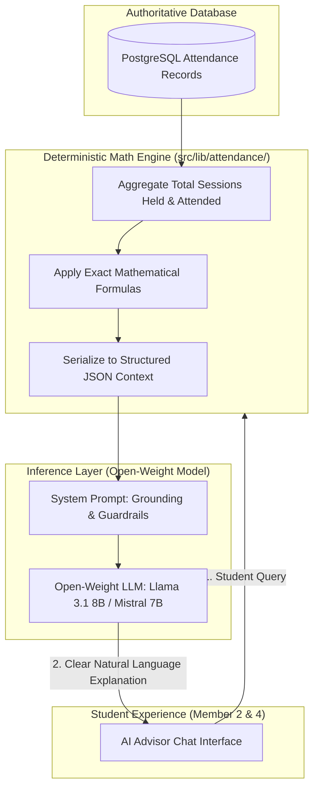

# AttendGuard AI Attendance Advisor

> **Deterministic Math Engine + Open-Weight LLM Inference Layer**  
> *Architectural blueprint, prompt engineering, privacy guardrails, and deterministic fallback.*

---

## Table of Contents

- [Advisory Mission & Problem Statement](#advisory-mission--problem-statement)
- [Core Architecture: Separation of Math and Language](#core-architecture-separation-of-math-and-language)
- [Mathematical Calculation Engine (Backend Authority)](#mathematical-calculation-engine-backend-authority)
  - [Formulas & Threshold Algorithms](#formulas--threshold-algorithms)
  - [Structured Context Schema](#structured-context-schema)
- [Open-Weight LLM Inference Layer](#open-weight-llm-inference-layer)
- [System Prompt & Context Injection Template](#system-prompt--context-injection-template)
- [Student Intent Handling & Sample Prompts](#student-intent-handling--sample-prompts)
- [Hallucination Mitigation & Guardrails](#hallucination-mitigation--guardrails)
- [Privacy & PII Protection](#privacy--pii-protection)
- [Fallback & Offline Mode (Zero-LLM Operation)](#fallback--offline-mode-zero-llm-operation)
- [Evaluation & Verification Criteria](#evaluation--verification-criteria)

---

## Advisory Mission & Problem Statement

College students frequently struggle to interpret institutional attendance criteria. University bylaws often mandate a strict minimum threshold (typically **75%**) for semester examination eligibility. When students fall behind, standard dashboards only display raw fractions (e.g., `14/21`), leaving students confused about:

- *"How many consecutive lectures must I attend without absence to get back above 75%?"*
- *"Can I afford to miss tomorrow's 8:00 AM class for an appointment without dipping below the warning threshold?"*
- *"Which of my enrolled courses is in critical jeopardy?"*

The **AttendGuard AI Attendance Advisor** solves this by providing clear, conversational, proactive academic guidance.

---

## Core Architecture: Separation of Math and Language

> [!CRITICAL]
> **Foundational Principle: The LLM is NEVER the Source of Truth.**  
> Large Language Models struggle with precise arithmetic. Under no circumstances should the LLM calculate percentages, count absences, or predict exam eligibility formulas independently.
> 
> **The Backend computes the exact integers. The LLM translates the trusted data into empathetic, actionable natural language.**



---

## Mathematical Calculation Engine (Backend Authority)

Implemented in `src/lib/attendance/calculator.ts`, the backend calculates exact numbers before invoking the LLM:

### Formulas & Threshold Algorithms

Given:
- $A$: Number of lectures attended by the student
- $T$: Total lectures conducted to date
- $M$: Minimum required percentage threshold (e.g., $75\% = 0.75$)

#### 1. Current Attendance Percentage
$$P = \left( \frac{A}{T} \right) \times 100$$

#### 2. Classes Needed to Reach 75% ($N_{\text{needed}}$)
If $P < 75\%$, how many consecutive upcoming classes $x$ must the student attend with $100\%$ attendance to reach $0.75$?
$$\frac{A + x}{T + x} \ge 0.75 \implies A + x \ge 0.75T + 0.75x \implies 0.25x \ge 0.75T - A$$
$$x = \left\lceil \frac{0.75T - A}{0.25} \right\rceil = \lceil 3T - 4A \rceil$$
*(If $x \le 0$, the student is already at or above 75%).*

#### 3. Classes Allowed to Miss ($N_{\text{safe\_miss}}$)
If $P \ge 75\%$, how many upcoming classes $y$ could the student miss while remaining $\ge 0.75$?
$$\frac{A}{T + y} \ge 0.75 \implies 0.75(T + y) \le A \implies y \le \frac{A - 0.75T}{0.75}$$
$$y = \left\lfloor \frac{A}{0.75} - T \right\rfloor$$

### Structured Context Schema
The calculation engine outputs a clean JSON payload passed to the prompt template:

```json
{
  "studentIdentifier": "ANON_STUDENT_99",
  "institutionalThreshold": 75.0,
  "courses": [
    {
      "courseCode": "CS301",
      "courseName": "Distributed Systems",
      "totalHeld": 20,
      "attended": 17,
      "currentPercentage": 85.0,
      "status": "SAFE",
      "classesNeededForThreshold": 0,
      "classesAllowedToMiss": 2
    },
    {
      "courseCode": "MATH202",
      "courseName": "Linear Algebra",
      "totalHeld": 22,
      "attended": 15,
      "currentPercentage": 68.2,
      "status": "AT_RISK",
      "classesNeededForThreshold": 3,
      "classesAllowedToMiss": 0
    }
  ]
}
```

---

## Open-Weight LLM Inference Layer

AttendGuard uses **open-weight, open-source models** to ensure cost control, data privacy, and predictable latency:

- **Primary Models**: `llama-3.1-8b-instant` or `mistral-7b-instruct`
- **Inference Protocols**: OpenAI-compatible REST endpoint (`/v1/chat/completions`)
- **Supported Providers**:
  - Cloud Inference: **Groq** (sub-second token generation) or **Together AI**
  - Local Offline Development: **Ollama** (`http://localhost:11434/v1`) running `llama3.1:8b`

Configuration resides in `.env.local`:
```env
AI_INFERENCE_BASE_URL=https://api.groq.com/openai/v1
AI_INFERENCE_API_KEY=gsk_your_key_here
AI_MODEL_NAME=llama-3.1-8b-instant
```

---

## System Prompt & Context Injection Template

```text
You are AttendGuard AI, an academic attendance advisor for university students.

YOUR OPERATIONAL RULES:
1. You MUST rely ONLY on the verified attendance data provided in the TRUSTED_DATA block below.
2. DO NOT perform arithmetic or calculate percentages yourself. The numbers in TRUSTED_DATA are authoritative.
3. If the user asks about a course not in TRUSTED_DATA, state that you do not have records for that course.
4. Speak in an encouraging, practical, and constructive academic tone.
5. Emphasize the institutional eligibility threshold (75%).
6. Be concise. Provide clear numbers directly without rambling.

TRUSTED_DATA:
{JSON_STRINGIFIED_DATA}

STUDENT_QUERY:
{USER_QUESTION}
```

---

## Student Intent Handling & Sample Prompts

| User Query | Backend Math Injection | AI Advisor Generated Response |
| :--- | :--- | :--- |
| *"Which subject is at risk?"* | `MATH202: 68.2%, status: AT_RISK, needed: 3` | "Your attendance in **MATH202 (Linear Algebra)** is currently at **68.2%** (15/22 held), which is below the 75% threshold. All other courses are in good standing." |
| *"Can I miss tomorrow's CS301 class?"* | `CS301: 85.0%, safeMiss: 2` | "Yes. You currently have **85.0%** in **CS301 (Distributed Systems)**. You can safely miss up to **2 upcoming classes** and still remain above the 75% threshold." |
| *"How many classes do I need to fix Linear Algebra?"* | `MATH202: needed: 3` | "You need to attend the next **3 consecutive classes** of **MATH202** without absence. That will bring your attendance back up to **75.0%** (18/25)." |
| *"Summarize my overall status."* | All courses array | "You are enrolled in 2 courses: **CS301** is safe at 85.0% (+2 buffer), while **MATH202** requires attention at 68.2% (need 3 consecutive attendances). Focus on attending your next Linear Algebra sessions!" |

---

## Hallucination Mitigation & Guardrails

To prevent typical LLM fabrications:
1. **Zero Raw Token Generation for Math**: If the student asks *"What is (15+3)/(22+3)?"*, the prompt instructions compel the model to look up `classesNeededForThreshold` rather than calculating.
2. **Temperature Clamping**: Set `temperature = 0.2` and `top_p = 0.9` to favor factual precision over creative liberty.
3. **Regex Sanity Check**: Before returning the AI response to the frontend, `src/lib/ai/validator.ts` verifies that any percentages mentioned in the text match percentages found in the structured context within $\pm 0.1\%$.

---

## Privacy & PII Protection

- **No Student Personal Info in Prompts**: The prompt **never** receives the student's legal name, email address, physical location, roll number, or IP address.
- **Anonymized Tokens**: Student IDs are replaced with anonymized session identifiers (`STUDENT_SESSION_X`).
- **Data Retention**: Prompts sent to inference endpoints are stateless; zero student attendance data is retained by third-party model providers.

---

## Fallback & Offline Mode (Zero-LLM Operation)

If the external inference API is unreachable, experiences rate limits (`429`), or goes offline, the backend gracefully activates a **Deterministic Rule-Based Fallback**:

```typescript
// src/lib/ai/fallback.ts
export function generateDeterministicAdvice(context: AttendanceSummary): string {
  const atRisk = context.courses.filter(c => c.status === 'AT_RISK');
  if (atRisk.length === 0) {
    return `Great job! All your enrolled courses are currently above the 75% threshold. Your overall average is ${context.overallPercentage}%.`;
  }

  const courseList = atRisk
    .map(c => `• ${c.courseName}: currently ${c.currentPercentage}%, you must attend the next ${c.classesNeededForThreshold} classes.`)
    .join('\n');

  return `Attention needed! You have ${atRisk.length} course(s) below the 75% threshold:\n${courseList}`;
}
```

The user receives a helpful response with an unobtrusive indicator: *(Generated via offline advisor engine)*.

---

## Evaluation & Verification Criteria

| Test Scenario | Input Data | Target Output Requirement |
| :--- | :--- | :--- |
| **At Risk Notification** | `MATH202: 68.2%` | Mentions 68.2%, flags under 75%, states 3 classes needed. |
| **Safe Miss Allowance** | `CS301: 85.0%` | Confirms student can miss next lecture, cites 2 classes buffer. |
| **Edge Case: Exactly 75%**| `PHYS101: 75.0%` | Advises student cannot miss upcoming lecture without dropping below 75%. |
| **Empty History** | `0 held` | Gracefully indicates that lectures have not commenced yet. |
| **API Timeout / 500** | Any context | Renders deterministic fallback message within 500ms. |
