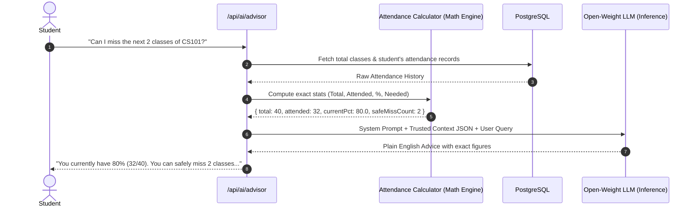

# AttendGuard System Architecture

> **Authoritative Technical Blueprint**  
> *Component relationships, trust boundaries, subsystem designs, and data flows.*

---

## Table of Contents

- [Architectural Overview](#architectural-overview)
- [Foundational Trust Principles](#foundational-trust-principles)
- [Complete Architecture Diagram](#complete-architecture-diagram)
- [Subsystem Breakdown](#subsystem-breakdown)
  - [1. Frontend Layer (Untrusted Client)](#1-frontend-layer-untrusted-client)
  - [2. Backend Layer (Authoritative Core)](#2-backend-layer-authoritative-core)
  - [3. Authentication & RBAC Layer](#3-authentication--rbac-layer)
  - [4. Dynamic QR & Session Subsystem](#4-dynamic-qr--session-subsystem)
  - [5. Database & Integrity Layer](#5-database--integrity-layer)
  - [6. Realtime Subsystem](#6-realtime-subsystem)
  - [7. AI Attendance Advisory Subsystem](#7-ai-attendance-advisory-subsystem)
- [Trust Boundaries & Security Perimeter](#trust-boundaries--security-perimeter)
- [Deployment & Infrastructure](#deployment--infrastructure)

---

## Architectural Overview

AttendGuard is structured as a full-stack, server-authoritative web application built on **Next.js (App Router)** and **Supabase (PostgreSQL, Auth, Realtime)**. 

The system departs fundamentally from legacy attendance applications that treat client submissions as truth. Instead, AttendGuard implements a **zero-trust client architecture**: any browser or mobile device interacting with the system is treated as potentially adversarial. The backend server maintains sole responsibility for validating challenges, verifying hardware identities, asserting timestamps, computing statistics, and committing attendance state to the database.

---

## Foundational Trust Principles

Every component in AttendGuard adheres to these two non-negotiable principles:

> [!CRITICAL]
> **Principle 1**: *"The frontend is treated as an untrusted client."*  
> The client cannot determine presence, compute eligibility percentages, mint valid QR tokens, or write directly to protected database tables.

> [!CRITICAL]
> **Principle 2**: *"The backend is the authority for attendance state."*  
> A student is only "Present" when the backend verifies the active session status, decrypts and validates the signed dynamic QR token within its time-to-live (TTL), checks the single registered device identity, enforces enrollment, and successfully commits an immutable database transaction.

---

## Complete Architecture Diagram

```mermaid
flowchart TB
    subgraph Clients ["Untrusted Client Layer (Browsers / Mobile)"]
        TeacherUI["Teacher Dashboard & Projector\n(Next.js Client Components)"]
        StudentUI["Student Mobile App / Scanner\n(Next.js Client Components)"]
    end

    subgraph EdgeGateway ["Edge / Next.js Routing"]
        Proxy["Next.js App Router\n(Middleware & Route Handlers)"]
    end

    subgraph BackendCore ["Authoritative Backend Services"]
        AuthService["Auth & RBAC Guard\n(Supabase Auth Session Validator)"]
        SessionService["Session Manager\n(Lifecycle, State Machine)"]
        QRService["QR Token Engine\n(HMAC-SHA256 Signer/Verifier)"]
        AttendanceEngine["Attendance Engine\n(Enrollment, Device, Constraints)"]
        CalcEngine["Deterministic Analytics Engine\n(Percentages, Strict Formulas)"]
        AuditService["Security Audit Logger\n(Append-Only Event Sink)"]
    end

    subgraph DataTier ["Persistence & Messaging Tier (Supabase)"]
        Postgres[(PostgreSQL Database\nTables, Constraints, Indexes)]
        RLS["Row Level Security (RLS)\nPolicies"]
        RealtimeHub["Supabase Realtime\n(WebSocket Broadcasting)"]
    end

    subgraph AIService ["AI Subsystem (Advisory Layer)"]
        AIContext["Context Builder\n(Injects Trusted Math JSON)"]
        OpenWeightLLM["Open-Weight LLM\n(Llama 3.1 / Mistral Inference)"]
    end

    %% Client Interactions
    TeacherUI -->|1. Start Session / Poll Token| Proxy
    StudentUI -->|2. Check-in Request (Token + Device)| Proxy

    %% Gateway Routing
    Proxy --> AuthService
    AuthService --> SessionService
    AuthService --> QRService
    AuthService --> AttendanceEngine

    %% Backend to Database
    SessionService --> Postgres
    AttendanceEngine --> Postgres
    AuditService --> Postgres
    Postgres --> RLS

    %% Realtime PubSub
    Postgres -->|Change Data Capture| RealtimeHub
    RealtimeHub -.->|Live Count Updates| TeacherUI
    RealtimeHub -.->|Re-verification Ping| StudentUI

    %% AI Advisory Flow
    StudentUI -->|Ask Advisory Query| Proxy
    Proxy --> CalcEngine
    CalcEngine -->|Trusted Calculations JSON| AIContext
    AIContext -->|Prompt + Strict Context| OpenWeightLLM
    OpenWeightLLM -->|Natural Language Advisory| StudentUI
```

---

## Subsystem Breakdown

### 1. Frontend Layer (Untrusted Client)

The frontend is built with **Next.js 14+ (App Router)**, **TypeScript**, **Tailwind CSS**, and **shadcn/ui**. It is split into two isolated persona workflows:

- **Student Interface (`/student`)**:
  - Optimized for mobile screens.
  - Controls the camera through HTML5 Barcode/QR APIs (`html5-qrcode`).
  - Stores a local cryptographic device identifier linked during device registration.
  - Displays attendance history, status alerts, and the AI Attendance Advisor chat interface.
  - Renders re-verification challenges when prompted by server events.
- **Teacher Interface (`/teacher`)**:
  - Optimized for large displays, laptops, and classroom projectors.
  - Renders the high-contrast dynamic QR code display component.
  - Listens to live check-in events over WebSockets via Supabase Realtime to render an animated attendee headcount counter and roster.
  - Provides controls to start/end sessions, trigger surprise re-verifications, and export attendance records.

### 2. Backend Layer (Authoritative Core)

Implemented through server-side **Next.js Route Handlers (`src/app/api/`)**:

- **Authentication Guard**: Intercepts requests, validates the Supabase session JWT, and enforces role requirements (`teacher` vs `student`).
- **Cryptographic QR Engine**: Generates short-lived, signed dynamic payloads for the projector. Verifies scanned payloads using server-only HMAC keys.
- **Attendance Decision Engine**: Validates four independent assertions before admitting attendance:
  1. Is the session currently in `active` state?
  2. Was the QR token scanned within its 20-second validity window?
  3. Does the request originate from the student's registered device fingerprint?
  4. Is the student actively enrolled in this class?
- **Audit Logger**: Asynchronously records security anomalies (expired QR attempts, unknown device logins, re-verification timeouts).

### 3. Authentication & RBAC Layer

- Backed by **Supabase Auth**.
- User accounts are provisioned with roles stored inside the `profiles` table:
  ```typescript
  type UserRole = 'student' | 'teacher';
  ```
- **Session Tokens**: All requests carry Supabase session cookies/JWTs verified server-side.
- **Device Registration Flow**: A student account can only have **one active registered device** in `registered_devices`. If a student attempts to log in or submit attendance from a secondary hardware identifier, the check-in is rejected until a teacher or admin authorizes a device reset.

### 4. Dynamic QR & Session Subsystem

Static QR codes are the primary vulnerability of digital attendance. AttendGuard uses a **Time-Varying Signed Challenge Token**:

```text
Payload: {
  sessionId: "uuid-v4",
  sequence: 42,
  timestamp: 1728224400,
  nonce: "8f7b2c9e"
}
Signature: HMAC-SHA256(Payload, QR_HMAC_SECRET)
Encoded QR: base64Url(Payload + "." + Signature)
```

1. **Rotation**: The teacher's browser polls or receives a new challenge every **15 to 30 seconds**.
2. **Replay Protection**: The backend verifies that the token's timestamp is within the allowable window ($\pm \text{TTL}$).
3. **Sequence Tracking**: Each token contains an incremental sequence number per session, preventing reuse of previous iterations.

### 5. Database & Integrity Layer

Powered by **Supabase PostgreSQL**. Data integrity is enforced at the database schema level rather than relying on application code:

- **Row Level Security (RLS)**: Enforces that students can read only their own attendance and profiles, while teachers can read records for their assigned classes.
- **Uniqueness Constraints**: A unique composite index on `(session_id, student_id)` guarantees that even concurrent check-in requests cannot create duplicate attendance records.
- **Foreign Key Constraints**: Cascading rules maintain referential integrity across classes, enrollments, sessions, and logs.

### 6. Realtime Subsystem

Powered by **Supabase Realtime (WebSocket Engine)**:

- **Live Headcount**: When an attendance record is committed, Supabase broadcasts an `INSERT` event on the `attendance_records` table filtered by `session_id`. The teacher's dashboard updates its live counter instantly without page refreshes.
- **In-Class Re-Verification Broadcast**: When a teacher triggers an in-class re-verification, a broadcast event is pushed to students enrolled in that session, opening a time-limited 60-second challenge modal.

### 7. AI Attendance Advisory Subsystem

The AI subsystem provides personalized, natural-language academic guidance to students while completely safeguarding mathematical integrity.



- **Strict Boundary**: The LLM is **never** permitted to calculate percentages, count absences, or query the database directly.
- **Context Injection**: The backend calculates the exact integers (`total_classes`, `attended_classes`, `current_percentage`, `classes_required_for_75`), serializes them into a structured JSON block, and instructs the LLM via system prompts to explain only those verified numbers.

---

## Trust Boundaries & Security Perimeter

```text
┌────────────────────────────────────────────────────────────────────────┐
│                        UNTRUSTED ZONE (Clients)                        │
│  • Student Phone (Camera, Device Storage, System Clock)                │
│  • Teacher Laptop / Projector Display                                  │
└──────────────────────────────────┬─────────────────────────────────────┘
                                   │ HTTPS / TLS 1.3
                                   ▼
┌────────────────────────────────────────────────────────────────────────┐
│                        TRUSTED ZONE (Backend)                          │
│  • Next.js Middleware (Session Auth & Role Validation)                 │
│  • Route Handlers (HMAC Verification, Server System Clock)             │
│  • PostgreSQL (Schema Constraints, Unique Indexes, RLS Policies)       │
│  • Secure Audit Logging Sink                                           │
└────────────────────────────────────────────────────────────────────────┘
```

1. **System Clock**: The server's clock is the single source of time truth. Timestamps reported by the client operating system are ignored during token validation.
2. **Attendance Creation**: There is **no client-accessible direct write** to `attendance_records`. All writes must occur via the protected `/api/attendance/check-in` handler.
3. **Device Association**: A student cannot rebind their own device ID. Device reset requires elevated teacher/admin credentials.

---

## Deployment & Infrastructure

- **Frontend & Route Handlers**: Deployed on **Vercel** with automatic preview deployments per Pull Request.
- **Database & Authentication**: Hosted on managed **Supabase** infrastructure (PostgreSQL 15+).
- **AI Inference Layer**: Accessed over HTTPS via an OpenAI-compatible endpoint connected to an open-weight model (e.g., Llama 3.1 8B on Groq or local Ollama for development).
- **Version Control**: Hosted on **GitHub**, enforcing feature branch isolation and mandatory code review.
