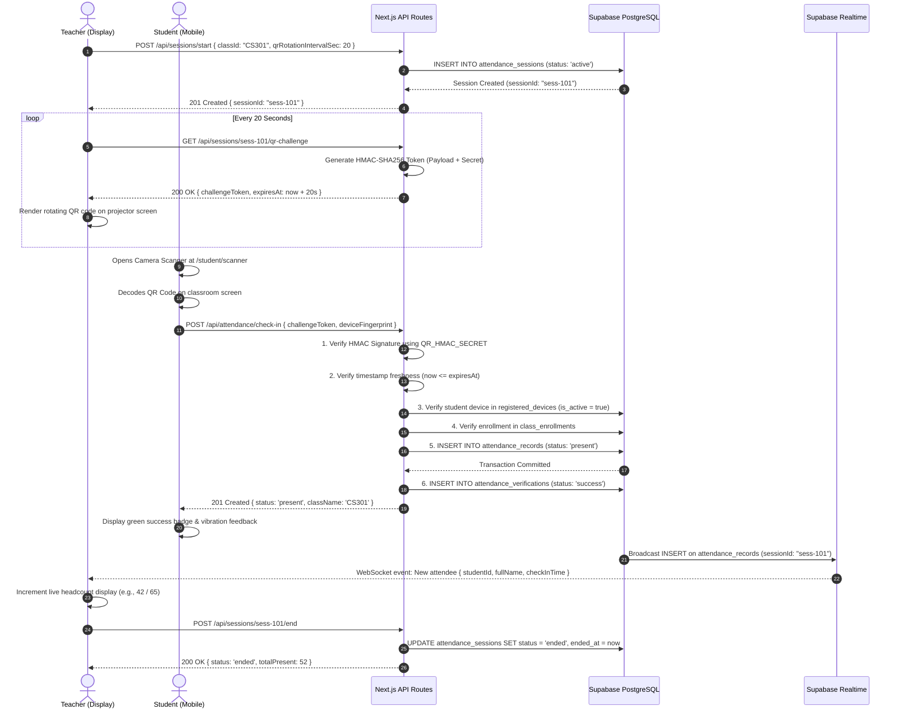
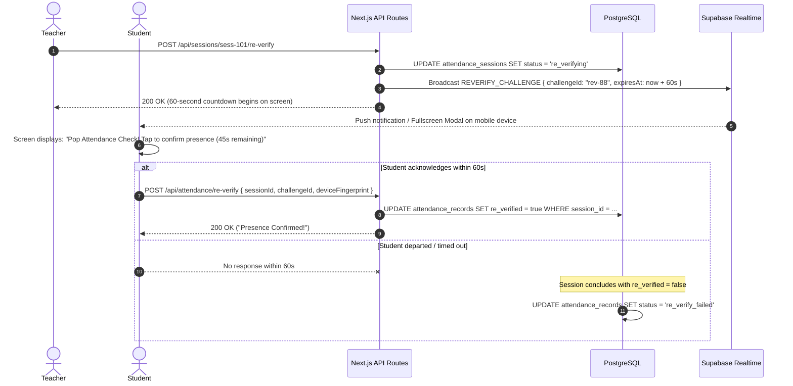

# AttendGuard End-to-End Attendance Workflows

> **Step-by-Step Teacher and Student Lifecycles, Edge Cases & Sequence Diagrams**  
> *Authoritative reference for user experience, system state transitions, and error recovery.*

---

## Table of Contents

- [Workflow Overview](#workflow-overview)
- [Primary Happy-Path Sequence Diagram](#primary-happy-path-sequence-diagram)
- [Teacher Workflow Lifecycle](#teacher-workflow-lifecycle)
- [Student Workflow Lifecycle](#student-workflow-lifecycle)
- [Random In-Class Re-Verification Flow](#random-in-class-re-verification-flow)
- [Failure Scenarios & Exception Handling](#failure-scenarios--exception-handling)
  - [1. Expired QR Token](#1-expired-qr-token)
  - [2. Invalid QR / Signature Mismatch](#2-invalid-qr--signature-mismatch)
  - [3. Duplicate Scan Attempt](#3-duplicate-scan-attempt)
  - [4. Unregistered Device / Device Mismatch](#4-unregistered-device--device-mismatch)
  - [5. Student Not Enrolled in Class](#5-student-not-enrolled-in-class)
  - [6. Session Inactive or Already Ended](#6-session-inactive-or-already-ended)
  - [7. Re-Verification Missed / Window Closed](#7-re-verification-missed--window-closed)
  - [8. Client Network Failure / Offline State](#8-client-network-failure--offline-state)
- [State Machine Transitions](#state-machine-transitions)

---

## Workflow Overview

AttendGuard establishes a synchronized, time-bound interaction between the classroom projector and student mobile devices. Attendance is not an isolated event; it is an active session overseen by the instructor from start to finish.

```text
[Teacher: Login] ──► [Select Class] ──► [Start Session] ──► [Project Dynamic QR (20s TTL)]
                                                                      │
                                                ┌─────────────────────┘
                                                ▼
[Student: Login] ──► [Device Check] ──► [Open Camera Scanner] ──► [Scan Dynamic QR]
                                                                      │
                                                ┌─────────────────────┘
                                                ▼
[Backend: Authoritative Validation (HMAC + Device + Time + Enrollment)]
                                                │
                       ┌────────────────────────┴────────────────────────┐
                       ▼                                                 ▼
             [Commit: Present]                                 [Reject with Code]
                       │                                                 │
          [Realtime Headcount Increments]                    [Display Error Guidance]
                       │
       [Optional Surprise In-Class Re-Verify]
                       │
        [Teacher Closes Session ──► Final State]
```

---

## Primary Happy-Path Sequence Diagram



---

## Teacher Workflow Lifecycle

### Step 1: Authentication & Navigation
- The teacher navigates to `/login` and provides faculty credentials.
- After validation, the teacher lands on `/teacher/dashboard`, which loads active classes for the current semester.

### Step 2: Session Initiation
- The teacher clicks **"Start Attendance"** on their chosen course card (e.g., `CS301: Distributed Systems`).
- The frontend issues `POST /api/sessions/start`. The backend creates a record in `attendance_sessions` with `status: 'active'`.

### Step 3: Dynamic QR Projection
- The teacher opens the **Projector Mode** (`/teacher/sessions/[id]`), maximizing the display on the classroom projector.
- The browser fetches dynamic challenge tokens via `GET /api/sessions/[id]/qr-challenge`.
- Every 15–20 seconds, the client fetches the next signed challenge and renders the new QR code with an animated countdown circular ring.

### Step 4: Real-Time Headcount Monitoring
- The teacher's view subscribes to the Supabase Realtime channel for `attendance_records` filtered by `session_id`.
- As students scan, the attendee counter increments with an animated counter, alongside a live roster of names and roll numbers.

### Step 5: (Optional) Surprise Re-Verification
- At any point mid-lecture, the teacher can click **"Trigger Re-Verification"**.
- A 60-second broadcast is fired to all checked-in student phones.

### Step 6: Session Conclusion
- When the attendance window ends, the teacher clicks **"End Session"**.
- The backend closes the session (`status = 'ended'`), locks the session from any further scans, and renders the summary report.

---

## Student Workflow Lifecycle

### Step 1: Login & Device Assertion
- The student opens `/login` on their mobile device.
- Upon authentication, the client calculates the local `deviceFingerprint`.
- If the student has never registered a device, they are prompted to complete one-time device binding.

### Step 2: Class Selection & Scanner Initialization
- On `/student/dashboard`, the student selects today's class.
- The student clicks **"Scan Classroom QR"**, granting camera permissions to the HTML5 QR scanner.

### Step 3: Scanning & Transmission
- The student points their mobile camera at the classroom projector screen.
- Upon decoding the QR code string, the scanner immediately halts video input to avoid duplicate rapid captures.
- The client sends `POST /api/attendance/check-in` containing:
  - `challengeToken` (the string scanned from the screen)
  - `deviceFingerprint` (the local client fingerprint)

### Step 4: Verification & Feedback
- The UI displays a brief loading spinner.
- Upon receiving `201 Created`, the UI triggers a success chime/haptic vibration and displays a bold green badge: **"Verified Present: CS301"**.
- If rejected, a clear error banner explains the specific reason (e.g., "QR Code Expired. Please scan the current code on the screen").

---

## Random In-Class Re-Verification Flow

Designed to eliminate the "scan and leave" exploit:



---

## Failure Scenarios & Exception Handling

---

### 1. Expired QR Token
- **Cause**: Student attempted to scan a photo taken 30 seconds ago from a WhatsApp group, or the projector refreshed the QR right as the student clicked capture.
- **Server Response**: HTTP 409 Conflict, `{ "error": { "code": "QR_EXPIRED", "message": "The attendance QR code has expired." } }`
- **UI Behavior**: Shows amber warning: *"QR code expired. Please point your camera at the current code displayed on the screen."* The scanner automatically restarts.

### 2. Invalid QR / Signature Mismatch
- **Cause**: Student scanned an arbitrary third-party QR code (e.g., student ID card, cafeteria menu) or a forged token payload.
- **Server Response**: HTTP 400 Bad Request, `{ "error": { "code": "QR_INVALID", "message": "Invalid attendance token format or signature." } }`
- **UI Behavior**: Red alert: *"Invalid QR Code. Please scan the official AttendGuard code on the classroom display."*

### 3. Duplicate Scan Attempt
- **Cause**: Student already scanned successfully and attempts to scan again in the same session.
- **Server Response**: HTTP 409 Conflict, `{ "error": { "code": "ALREADY_CHECKED_IN", "message": "Attendance has already been recorded for this session." } }`
- **UI Behavior**: Informational alert: *"You are already marked Present for this class."* Redirects to the student dashboard.

### 4. Unregistered Device / Device Mismatch
- **Cause**: An attending student logged into an absent friend's account on their personal phone.
- **Server Response**: HTTP 403 Forbidden, `{ "error": { "code": "DEVICE_MISMATCH", "message": "Attendance must be submitted from your registered device." } }`
- **UI Behavior**: Security alert: *"This device does not match your registered hardware. To update your registered device, request a reset from your instructor."*

### 5. Student Not Enrolled in Class
- **Cause**: Student walked into the wrong lecture hall or scanned a QR code for a course they do not take.
- **Server Response**: HTTP 403 Forbidden, `{ "error": { "code": "NOT_ENROLLED", "message": "You are not enrolled in this course." } }`
- **UI Behavior**: Red alert: *"You are not enrolled in CS301. Attendance cannot be recorded."*

### 6. Session Inactive or Already Ended
- **Cause**: Student scanned seconds after the teacher pressed "End Session".
- **Server Response**: HTTP 409 Conflict, `{ "error": { "code": "SESSION_INACTIVE", "message": "This attendance session has ended." } }`
- **UI Behavior**: Warning banner: *"This attendance session is closed. Speak with your instructor if you arrived before dismissal."*

### 7. Re-Verification Missed / Window Closed
- **Cause**: Student did not respond within the 60-second in-class window.
- **Server Response**: HTTP 409 Conflict, `{ "error": { "code": "REVERIFY_WINDOW_CLOSED", "message": "The re-verification window has expired." } }`
- **UI Behavior**: System marks record as `re_verify_failed`. Student is notified: *"Re-verification window expired. Attendance flagged for instructor review."*

### 8. Client Network Failure / Offline State
- **Cause**: Weak Wi-Fi or cellular signal in campus basement lecture hall.
- **Client Handling**: The scanner client intercepts the `fetch` error and displays a retry card: *"Network connection lost. Please reconnect and scan again. QR codes refresh every 20 seconds."*

---

## State Machine Transitions

### Attendance Session State Machine
```text
[Created] ──► (Teacher starts) ──► [ACTIVE]
                                      │
                   ┌──────────────────┴──────────────────┐
                   ▼                                     ▼
        (Teacher re-verifies)                   (Teacher ends)
                   ▼                                     ▼
            [RE_VERIFYING]                          [ENDED]
                   │                                     ▲
                   └─────────── (Window expires) ────────┘
```

### Attendance Record State Machine
```text
[Non-Existent] ──► (Valid QR + Device Check) ──► [PRESENT]
                                                     │
                   ┌─────────────────────────────────┴─────────────────────────────────┐
                   ▼                                                                   ▼
       (Re-verification Passed)                                            (Re-verification Missed)
                   ▼                                                                   ▼
       [PRESENT (re_verified=true)]                                        [RE_VERIFY_FAILED]
```
