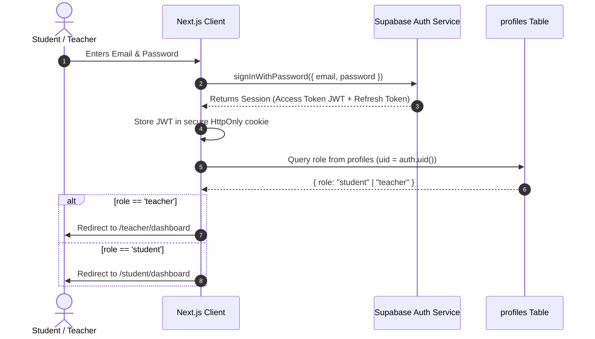
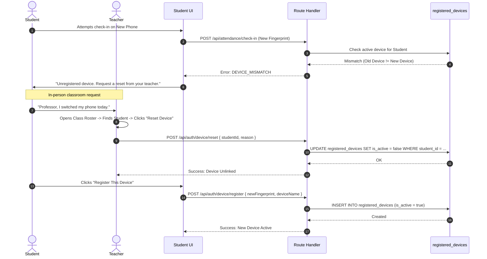

# AttendGuard Authentication & Device Identity

> **Authentication, Role-Based Access Control (RBAC) & Registered Device Policy**  
> *Clear definitions of identity, permissions, session lifecycles, and hardware binding.*

---

## Table of Contents

- [Core Identity Distinctions](#core-identity-distinctions)
- [Authentication Architecture (Supabase Auth)](#authentication-architecture-supabase-auth)
- [Role-Based Access Control (RBAC)](#role-based-access-control-rbac)
- [Session Management & Expiration](#session-management--expiration)
- [The Registered Device System](#the-registered-device-system)
  - [Why Device Registration?](#why-device-registration)
  - [Single Active Device Policy](#single-active-device-policy)
  - [Device Fingerprinting Mechanics](#device-fingerprinting-mechanics)
  - [Device Replacement & Reset Flow](#device-replacement--reset-flow)
  - [Honest Security Limitations](#honest-security-limitations)
- [Unauthorized Access & Attack Mitigations](#unauthorized-access--attack-mitigations)

---

## Core Identity Distinctions

To ensure clean engineering boundaries across frontend and backend implementations, AttendGuard strictly delineates three concepts:

```text
┌────────────────────────────────────────────────────────────────────────┐
│ 1. AUTHENTICATION ("Who are you?")                                    │
│    Verified via Supabase Auth email/password credentials.              │
│    Produces an authentic JWT tied to a unique UUID.                    │
├────────────────────────────────────────────────────────────────────────┤
│ 2. AUTHORIZATION ("What are you allowed to do?")                       │
│    Verified via the user's role in the `profiles` table.               │
│    Determines whether the user accesses /student or /teacher routes.  │
├────────────────────────────────────────────────────────────────────────┤
│ 3. DEVICE REGISTRATION ("Which trusted hardware are you using?")      │
│    Verified via client hardware/browser fingerprint matching           │
│    `registered_devices`. Blocks proxy check-ins from lent credentials. │
└────────────────────────────────────────────────────────────────────────┘
```

---

## Authentication Architecture (Supabase Auth)

AttendGuard uses **Supabase Auth** with email and password credentials for institutional users.



### Roles Supported
- **`teacher`**: Granted access to `/teacher/*` routes, session creation, dynamic QR rotation, and report export.
- **`student`**: Granted access to `/student/*` routes, mobile QR scanner, history, and AI Advisor.

---

## Role-Based Access Control (RBAC)

RBAC is enforced at two distinct boundaries:

### 1. Edge Middleware (`src/middleware.ts`)
Next.js middleware inspects incoming requests and validates the user's role before serving pages:
- If an unauthenticated user accesses `/student/*` or `/teacher/*`, they are redirected to `/login`.
- If a user with `role: 'student'` attempts to load `/teacher/*`, they receive a `403 Forbidden` redirect.
- If a user with `role: 'teacher'` attempts to submit `/api/attendance/check-in`, the route handler rejects with `403 FORBIDDEN`.

### 2. Route Handler Guards (`src/lib/auth/guards.ts`)
Every API route validates the session server-side:
```typescript
export async function requireRole(req: NextRequest, allowedRole: 'teacher' | 'student') {
  const supabase = createServerClient(...);
  const { data: { user } } = await supabase.auth.getUser();

  if (!user) {
    throw new AuthError('UNAUTHORIZED', 401, 'Authentication required');
  }

  const { data: profile } = await supabase
    .from('profiles')
    .select('role')
    .eq('id', user.id)
    .single();

  if (profile?.role !== allowedRole) {
    throw new AuthError('FORBIDDEN', 403, `Access denied for role: ${profile?.role}`);
  }

  return { user, profile };
}
```

---

## Session Management & Expiration

1. **Access Tokens**: Short-lived JWTs (typically 1 hour) stored in secure, `SameSite=Lax`, `HttpOnly` cookies.
2. **Refresh Tokens**: Stored securely to automatically rotate expired access tokens during active browsing.
3. **Logout**: Calling `supabase.auth.signOut()` invalidates the session, purges cookies, and redirects the user to `/login`.
4. **Session Expiration during Class**: If a token expires while a teacher is projecting a QR code, the teacher display gracefully attempts a background token refresh. If refresh fails, projection freezes with a re-login prompt to prevent unauthorized challenge issuance.

---

## The Registered Device System

### Why Device Registration?
Simple email/password login is vulnerable to **credential sharing**: absent students share their login credentials with an attending friend, who logs in via a second browser tab or spare phone and scans the QR code.

To counter this, AttendGuard implements **Single Registered Device Enforcement**.

### Single Active Device Policy
- Each student account can have **exactly one** active device registered in `registered_devices`.
- When an enrolled student attempts to submit attendance via `/api/attendance/check-in`, the backend checks whether the incoming `deviceFingerprint` matches the student's active device in the database.
- If it does not match, the check-in is rejected with `DEVICE_MISMATCH` (HTTP 403), and a security verification attempt is logged.

### Device Fingerprinting Mechanics
During initial login, the student browser computes a deterministic device fingerprint derived from stable hardware and environment attributes:
- Screen resolution & color depth
- Hardware concurrency (`navigator.hardwareConcurrency`)
- Device memory (`navigator.deviceMemory`)
- AudioContext signature
- Platform & WebGL rendering vendor

The client hashes these attributes using SHA-256 and combines them with a persistent cryptographically generated device UUID stored in `localStorage`:

```text
deviceFingerprint = SHA-256(persistentDeviceUUID + ":" + browserHardwareHash)
```

### Device Replacement & Reset Flow

When a student upgrades their phone, replaces a damaged screen, or switches browsers:



### Honest Security Limitations

> [!WARNING]
> **Device identification is NOT impossible to spoof.**  
> Advanced students with software engineering experience could inspect browser developer tools, extract their assigned `persistentDeviceUUID`, and forge matching HTTP headers from a secondary device.
> 
> Therefore, AttendGuard treats device registration as a **friction and deterrence layer** that eliminates casual proxy attendance, not as an unbreakable biometric enclave. It operates in tandem with short-lived dynamic QR tokens and random re-verifications.

---

## Unauthorized Access & Attack Mitigations

| Threat | System Defense | Outcome |
| :--- | :--- | :--- |
| **Student accesses Teacher routes** | Middleware role check + API `requireRole('teacher')` | Request blocked with `403 Forbidden`. |
| **Friend logs into absent student's account on their phone** | Active `deviceFingerprint` check against `registered_devices` | Check-in rejected with `DEVICE_MISMATCH`. Attempt flagged in audit logs. |
| **Student attempts to register multiple phones** | PostgreSQL partial unique index on `(student_id) WHERE is_active = true` | Database rejects with constraint violation (`409 Conflict`). |
| **Student alters client clock to bypass token expiry** | Server evaluates token freshness exclusively using `NOW()` from PostgreSQL | Clock manipulation has zero effect. |
