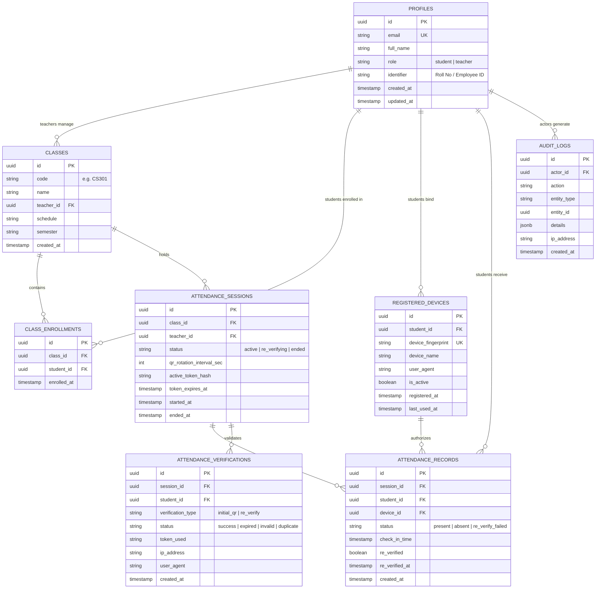

# AttendGuard Database Specification

> **PostgreSQL Schema, Constraints, Row Level Security (RLS) & Lifecycle**  
> *Authoritative schema design for Supabase PostgreSQL.*

---

## Table of Contents

- [Entity Relationship Overview](#entity-relationship-overview)
- [Mermaid ER Diagram](#mermaid-er-diagram)
- [Table Schemas](#table-schemas)
  - [1. profiles](#1-profiles)
  - [2. classes](#2-classes)
  - [3. class_enrollments](#3-class_enrollments)
  - [4. attendance_sessions](#4-attendance_sessions)
  - [5. attendance_records](#5-attendance_records)
  - [6. registered_devices](#6-registered_devices)
  - [7. attendance_verifications](#7-attendance_verifications)
  - [8. audit_logs](#8-audit_logs)
- [Integrity & Anti-Duplicate Protection](#integrity--anti-duplicate-protection)
- [Row Level Security (RLS) Policies](#row-level-security-rls-policies)
- [Indexes & Performance](#indexes--performance)
- [Migration Strategy](#migration-strategy)
- [Seed Data & Testing Records](#seed-data--testing-records)
- [Data Lifecycle & Retention](#data-lifecycle--retention)

---

## Entity Relationship Overview

AttendGuard structures its relational hierarchy around classes and sessions:

```text
[Teacher (Profile)]
       │
       ▼ (1:N)
   [classes]
       │
       ├─────────────────────────┐
       ▼ (1:N)                   ▼ (1:N)
[attendance_sessions]     [class_enrollments] ◄─── (N:1) [Student (Profile)]
       │                                                      │
       ▼ (1:N)                                                │ (1:1 Active)
[attendance_records] ◄────────────────────────────────────────┘
       ▲                                                 [registered_devices]
       │ (1:N)
[attendance_verifications]
```

- A **Teacher** owns multiple **Classes**.
- A **Class** has many enrolled **Students** through `class_enrollments`.
- A **Class** hosts sequential **Attendance Sessions**.
- An **Attendance Session** yields **Attendance Records** for enrolled Students.
- An **Attendance Record** is backed by an active record in **Registered Devices** and logged under **Attendance Verifications**.

---

## Mermaid ER Diagram



---

## Table Schemas

---

### 1. `profiles`
Stores extended user profile information linked to Supabase Auth `auth.users`.

| Column | Type | Constraints | Description |
| :--- | :--- | :--- | :--- |
| `id` | `UUID` | `PRIMARY KEY`, references `auth.users(id)` ON DELETE CASCADE | Matches Supabase Auth user ID. |
| `email` | `TEXT` | `NOT NULL`, `UNIQUE` | User email address. |
| `full_name` | `TEXT` | `NOT NULL` | Display name of student/teacher. |
| `role` | `TEXT` | `NOT NULL`, `CHECK (role IN ('student', 'teacher'))` | System RBAC authorization role. |
| `identifier` | `TEXT` | `NOT NULL`, `UNIQUE` | University Roll Number or Faculty ID. |
| `created_at` | `TIMESTAMPTZ` | `NOT NULL`, `DEFAULT NOW()` | Account creation timestamp. |
| `updated_at` | `TIMESTAMPTZ` | `NOT NULL`, `DEFAULT NOW()` | Last update timestamp. |

---

### 2. `classes`
Represents academic courses managed by teachers.

| Column | Type | Constraints | Description |
| :--- | :--- | :--- | :--- |
| `id` | `UUID` | `PRIMARY KEY`, `DEFAULT gen_random_uuid()` | Class unique identifier. |
| `code` | `TEXT` | `NOT NULL` | Course code (e.g., `CS301`, `MATH202`). |
| `name` | `TEXT` | `NOT NULL` | Course title (e.g., "Distributed Systems"). |
| `teacher_id` | `UUID` | `NOT NULL`, references `profiles(id)` | Teacher responsible for class. |
| `schedule` | `TEXT` | `NOT NULL` | Description of class timings (e.g., "Mon/Wed 10:00-11:30"). |
| `semester` | `TEXT` | `NOT NULL` | Academic term (e.g., "Fall 2026"). |
| `created_at` | `TIMESTAMPTZ` | `NOT NULL`, `DEFAULT NOW()` | Creation timestamp. |

---

### 3. `class_enrollments`
Junction table mapping students to their enrolled classes.

| Column | Type | Constraints | Description |
| :--- | :--- | :--- | :--- |
| `id` | `UUID` | `PRIMARY KEY`, `DEFAULT gen_random_uuid()` | Unique enrollment record ID. |
| `class_id` | `UUID` | `NOT NULL`, references `classes(id)` ON DELETE CASCADE | Target class. |
| `student_id` | `UUID` | `NOT NULL`, references `profiles(id)` ON DELETE CASCADE | Enrolled student. |
| `enrolled_at` | `TIMESTAMPTZ` | `NOT NULL`, `DEFAULT NOW()` | Enrollment timestamp. |

**Constraints**:
- `UNIQUE(class_id, student_id)` — Prevents duplicate enrollments.

---

### 4. `attendance_sessions`
Represents individual teacher-initiated attendance events.

| Column | Type | Constraints | Description |
| :--- | :--- | :--- | :--- |
| `id` | `UUID` | `PRIMARY KEY`, `DEFAULT gen_random_uuid()` | Session ID. |
| `class_id` | `UUID` | `NOT NULL`, references `classes(id)` ON DELETE CASCADE | Related class. |
| `teacher_id` | `UUID` | `NOT NULL`, references `profiles(id)` | Session host. |
| `status` | `TEXT` | `NOT NULL`, `CHECK (status IN ('active', 're_verifying', 'ended'))`, `DEFAULT 'active'` | Session lifecycle state. |
| `qr_rotation_interval_sec` | `INTEGER` | `NOT NULL`, `DEFAULT 20` | QR rotation cycle in seconds. |
| `active_token_hash`| `TEXT` | `NULLABLE` | SHA-256 hash of currently active rotating token. |
| `token_expires_at` | `TIMESTAMPTZ`| `NULLABLE` | Expiry of current rotating challenge token. |
| `started_at` | `TIMESTAMPTZ` | `NOT NULL`, `DEFAULT NOW()` | Start timestamp. |
| `ended_at` | `TIMESTAMPTZ` | `NULLABLE` | Termination timestamp. |

---

### 5. `attendance_records`
Authoritative attendance ledger. Contains approved attendance outcomes.

| Column | Type | Constraints | Description |
| :--- | :--- | :--- | :--- |
| `id` | `UUID` | `PRIMARY KEY`, `DEFAULT gen_random_uuid()` | Record ID. |
| `session_id` | `UUID` | `NOT NULL`, references `attendance_sessions(id)` ON DELETE CASCADE | Related attendance session. |
| `student_id` | `UUID` | `NOT NULL`, references `profiles(id)` ON DELETE CASCADE | Attending student. |
| `device_id` | `UUID` | `NOT NULL`, references `registered_devices(id)` | Trusted device used during check-in. |
| `status` | `TEXT` | `NOT NULL`, `CHECK (status IN ('present', 'absent', 're_verify_failed'))`, `DEFAULT 'present'` | Verification outcome. |
| `check_in_time` | `TIMESTAMPTZ` | `NOT NULL`, `DEFAULT NOW()` | Timestamp of initial QR scan. |
| `re_verified` | `BOOLEAN` | `NOT NULL`, `DEFAULT false` | Whether random re-verification was acknowledged. |
| `re_verified_at`| `TIMESTAMPTZ` | `NULLABLE` | Timestamp of re-verification response. |
| `created_at` | `TIMESTAMPTZ` | `NOT NULL`, `DEFAULT NOW()` | Record creation timestamp. |

**Constraints**:
- `UNIQUE(session_id, student_id)` — **Crucial**: Prevents a student from being checked in twice for the same session.

---

### 6. `registered_devices`
Stores trusted device hardware/browser fingerprints bound to student accounts.

| Column | Type | Constraints | Description |
| :--- | :--- | :--- | :--- |
| `id` | `UUID` | `PRIMARY KEY`, `DEFAULT gen_random_uuid()` | Device ID. |
| `student_id` | `UUID` | `NOT NULL`, references `profiles(id)` ON DELETE CASCADE | Associated student. |
| `device_fingerprint` | `TEXT` | `NOT NULL` | SHA-256 hash of client fingerprint. |
| `device_name` | `TEXT` | `NOT NULL` | Human-readable device label. |
| `user_agent` | `TEXT` | `NULLABLE` | Browser user-agent string. |
| `is_active` | `BOOLEAN` | `NOT NULL`, `DEFAULT true` | Only active devices may mark attendance. |
| `registered_at`| `TIMESTAMPTZ` | `NOT NULL`, `DEFAULT NOW()` | Binding date. |
| `last_used_at` | `TIMESTAMPTZ` | `NOT NULL`, `DEFAULT NOW()` | Last successful check-in timestamp. |

**Constraints**:
- Partial unique index: `CREATE UNIQUE INDEX unique_active_device_per_student ON registered_devices (student_id) WHERE is_active = true;`  
  *(Ensures a student can have at most one active device at any moment).*

---

### 7. `attendance_verifications`
Detailed event log of every check-in and re-verification attempt (successful or rejected).

| Column | Type | Constraints | Description |
| :--- | :--- | :--- | :--- |
| `id` | `UUID` | `PRIMARY KEY`, `DEFAULT gen_random_uuid()` | Verification log ID. |
| `session_id` | `UUID` | `NOT NULL`, references `attendance_sessions(id)` ON DELETE CASCADE | Related session. |
| `student_id` | `UUID` | `NOT NULL`, references `profiles(id)` ON DELETE CASCADE | Student attempting verification. |
| `verification_type`| `TEXT` | `NOT NULL`, `CHECK (verification_type IN ('initial_qr', 're_verify_challenge'))` | Type of challenge. |
| `status` | `TEXT` | `NOT NULL`, `CHECK (status IN ('success', 'expired', 'invalid', 'duplicate', 'device_mismatch'))` | Outcome. |
| `token_used` | `TEXT` | `NULLABLE` | Token snippet or hash for forensic debugging. |
| `ip_address` | `TEXT` | `NULLABLE` | Client IP address. |
| `user_agent` | `TEXT` | `NULLABLE` | Client user agent. |
| `created_at` | `TIMESTAMPTZ` | `NOT NULL`, `DEFAULT NOW()` | Verification event timestamp. |

---

### 8. `audit_logs`
Append-only log for administrative and security actions.

| Column | Type | Constraints | Description |
| :--- | :--- | :--- | :--- |
| `id` | `UUID` | `PRIMARY KEY`, `DEFAULT gen_random_uuid()` | Log ID. |
| `actor_id` | `UUID` | `NULLABLE`, references `profiles(id)` | User who executed action. |
| `action` | `TEXT` | `NOT NULL` | E.g., `DEVICE_RESET`, `SESSION_FORCE_CLOSE`, `SUSPICIOUS_SCAN`. |
| `entity_type` | `TEXT` | `NOT NULL` | E.g., `registered_devices`, `attendance_sessions`. |
| `entity_id` | `UUID` | `NULLABLE` | ID of the entity acted upon. |
| `details` | `JSONB` | `NOT NULL`, `DEFAULT '{}'::jsonb` | Structured contextual metadata. |
| `ip_address` | `TEXT` | `NULLABLE` | Request IP address. |
| `created_at` | `TIMESTAMPTZ` | `NOT NULL`, `DEFAULT NOW()` | Log timestamp. |

---

## Integrity & Anti-Duplicate Protection

1. **Database-Level Constraint**:
   ```sql
   ALTER TABLE attendance_records
   ADD CONSTRAINT unique_session_student_attendance
   UNIQUE (session_id, student_id);
   ```
   Even if a network glitch triggers concurrent client requests, PostgreSQL serializes the transaction and fails the duplicate with SQLSTATE `23505`.

2. **Single Active Device Policy**:
   ```sql
   CREATE UNIQUE INDEX idx_single_active_device_per_student
   ON registered_devices (student_id)
   WHERE is_active = true;
   ```

---

## Row Level Security (RLS) Policies

All tables have RLS enabled (`ALTER TABLE ... ENABLE ROW LEVEL SECURITY;`).

### `profiles`
- **Read**: Authenticated users can view their own profile; teachers can view student profiles in their classes.
- **Write**: Only backend service role or profile owner (limited fields) can update.

### `attendance_sessions`
- **Read**: Teachers can read sessions they own; enrolled students can read active sessions for their enrolled classes.
- **Insert/Update**: Only teachers owning the class can start, modify, or end sessions.

### `attendance_records`
- **Read**: Students can read their own attendance records (`student_id = auth.uid()`). Teachers can read attendance records for sessions belonging to their classes.
- **Insert/Update**: **Blocked from public client execution**. Only the server-side service role via Next.js Route Handlers (`/api/attendance/check-in`) may insert or modify attendance records.

### `registered_devices`
- **Read**: Students can view their registered devices. Teachers can view devices of students in their classes.
- **Insert**: Students can insert only if no active device currently exists.
- **Update**: Only teachers or service role can deactivate or reset devices.

---

## Indexes & Performance

```sql
-- Fast query for student attendance history
CREATE INDEX idx_attendance_records_student_id ON attendance_records (student_id);

-- Fast lookup for session live headcount
CREATE INDEX idx_attendance_records_session_id ON attendance_records (session_id);

-- Fast active session lookups
CREATE INDEX idx_attendance_sessions_class_status ON attendance_sessions (class_id, status);

-- Device lookup by fingerprint
CREATE INDEX idx_registered_devices_fingerprint ON registered_devices (device_fingerprint);
```

---

## Migration Strategy

Migrations are managed via the standard Supabase CLI pipeline located in `supabase/migrations/`:

1. `001_initial_schema.sql`: Base tables, foreign keys, unique constraints, and enum checks.
2. `002_rls_policies.sql`: Row Level Security policies and security definer functions.
3. `003_performance_indexes.sql`: B-tree indexes on foreign keys and lookup queries.

To apply locally:
```bash
npx supabase db reset
```

---

## Seed Data & Testing Records

Located in `supabase/seed.sql`:
- **1 Teacher**: `prof.turing@university.edu` (`role: 'teacher'`)
- **2 Classes**: `CS301` (Distributed Systems), `MATH202` (Linear Algebra)
- **4 Students**: Enrolled in `CS301` with pre-registered devices.
- **Sample Past Sessions**: Populated with mixed `present` and `absent` records to test the AI Attendance Advisor and analytics charts immediately.

---

## Data Lifecycle & Retention

1. **Active Sessions**: Kept in `active` state for 5–15 minutes until teacher closes the session (`ended`).
2. **Attendance Verifications Log**: Retained for 90 days for forensic review; can be archived by cron jobs.
3. **Audit Logs**: Retained permanently in cold storage for institutional compliance.
